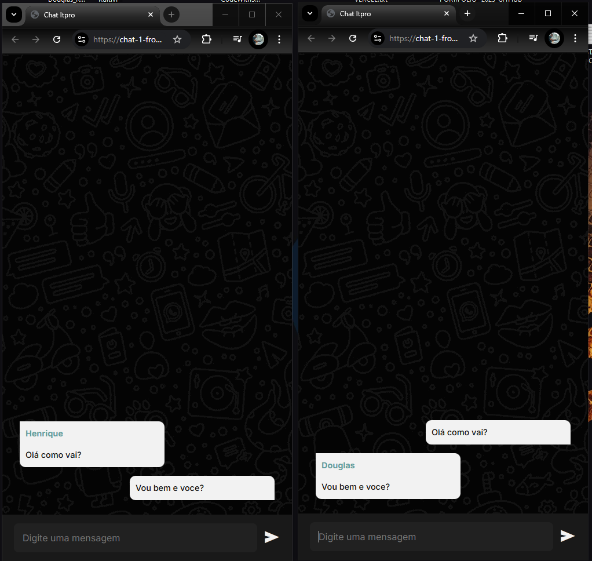

# Projeto Chat online

## Descrição
Projeto de criação de chat online, com o intuido de entender inicialmente como funciona.

## Tecnologias utilizadas

- HTML
- CSS
- NODE
- WS (WebSocket)

## Funcionalidades
- Login

- Chat em grupo com quem se conectar

## Link do projeto

https://chat-1-frontend.onrender.com/